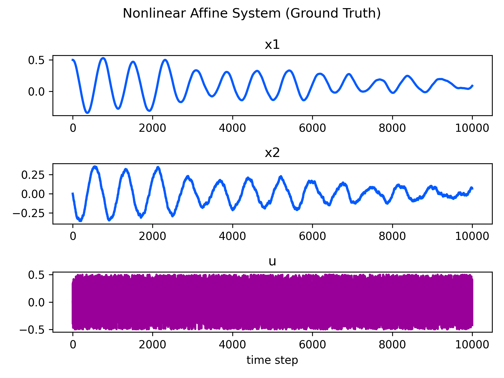
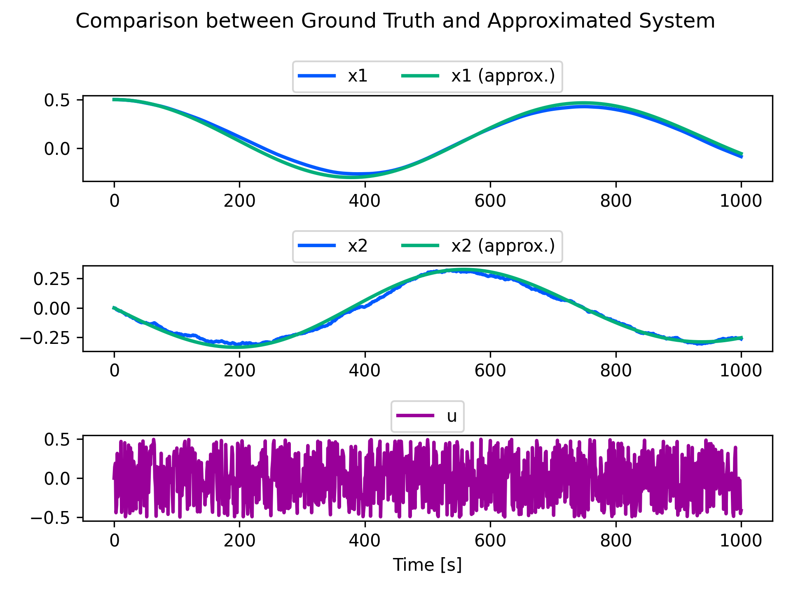

[](https://opensource.org/licenses/MIT)
[](https://rye.astral.sh)

# Koopman Operator

## Dependency

- [python](https://www.python.org/)
  - version 3.10 or higher is recommended.

- [rye](https://rye.astral.sh/)
  - seting up python environment easily and safely.
  - only `numpy`, `matplotlib`, `notebook` are needed to run all scripts in this repository.

## Setup
```sh
git clone https://github.com/MizuhoAOKI/koopman_operator.git
cd koopman_operator
rye sync
```

## Usage

### [Ex. 1] Prediction of nonlinear affine system
```sh
cd kooopman_operator
rye run jupyter notebook notebooks/koopman_operator_ex1.ipynb
```

#### Nonlinear affine system (ground truth)



#### Comparison between ground truth and approximated system by koopman operator




## References
- Milan Korda, Igor Mezić, Linear predictors for nonlinear dynamical systems: Koopman operator meets model predictive control, Automatica,2018
- 薄良彦, クープマン作用素による非線形システムの制御, 計測と制御, 2022
