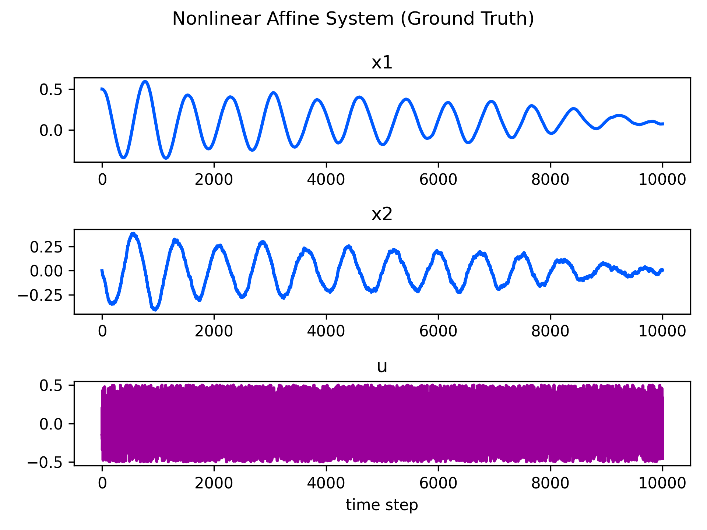
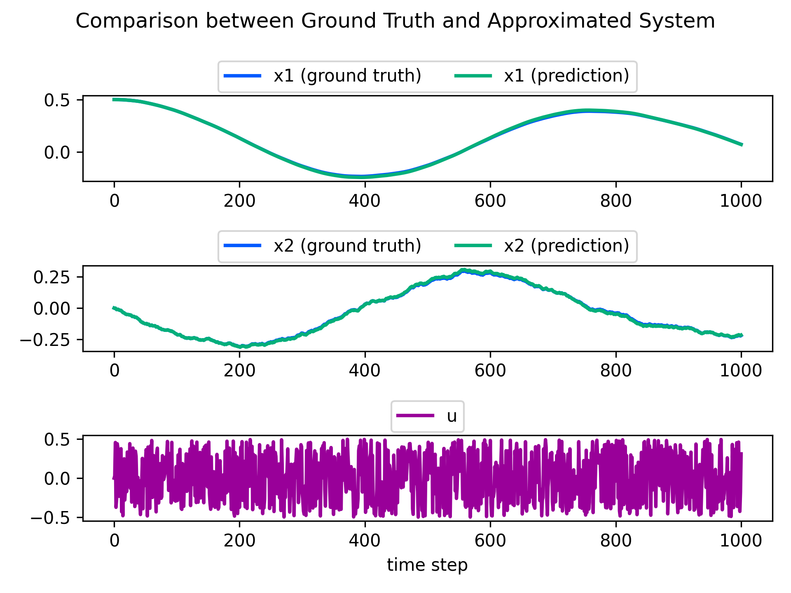

[](https://opensource.org/licenses/MIT)
[](https://rye.astral.sh)

# Koopman Operator

## Dependency

- [python](https://www.python.org/)
  - version 3.10 or higher is recommended.

- [rye](https://rye.astral.sh/)
  - seting up python environment easily and safely.
  - only `numpy`, `matplotlib`, `notebook` are needed to run all scripts in this repository.

## Setup
```sh
git clone https://github.com/MizuhoAOKI/koopman_operator.git
cd koopman_operator
rye sync
```

## Usage

### [Ex. 1] Prediction of nonlinear affine system
```sh
cd kooopman_operator
rye run jupyter notebook notebooks/koopman_operator_ex1.ipynb
```

#### Single machine infinite bus system (ground truth)

<!--
```math
\begin{align}
&\text{system state }\bm{x}\in \mathbb{R}^2 \text{:} \quad \bm{x} = [x_1, x_2], \nonumber \\
&\text{control input }\bm{u}\in \mathbb{R} \text{:} \quad \bm{u} = [u_1], \nonumber \\
&\text{parameters: } D, B, P \in \mathbb{R}. \nonumber \\
\end{align}
```

The state update rule is given by the following equation.
```math
\begin{equation}
\left\{
\begin{align}
\frac{\rm{d}}{\rm{d}t} x_1 &= x_2 \nonumber \\
\frac{\rm{d}}{\rm{d}t} x_2 &= -D x_2 - B \sin x_1 + P + u_1 \nonumber \\
\end{align}
\right. \nonumber
\end{equation}
```
-->



#### Comparison between ground truth and approximated system by koopman operator




## References
- [Milan Korda, Igor Mezić, Linear predictors for nonlinear dynamical systems: Koopman operator meets model predictive control, Automatica, 2018](https://www.sciencedirect.com/science/article/pii/S000510981830133X)
- [薄良彦, クープマン作用素による非線形システムの制御, 計測と制御, 2022](https://www.jstage.jst.go.jp/article/sicejl/61/2/61_133/_article/-char/ja/)

